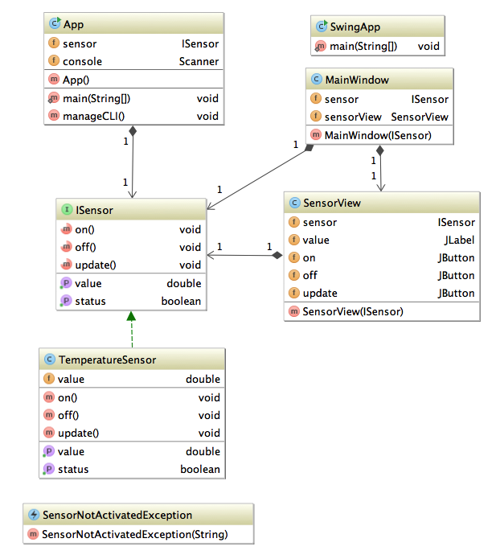
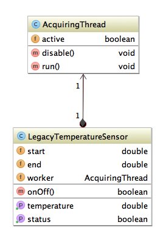

Design Patterns Labs
=========

## Provided Java Code

This project provides few basic classes to be used during the "Design Pattern" labs.

#### Core classes

<code>eu.telecomnancy.ISensor</code>: An interface that brand new sensor must implement.  
<code>eu.telecomnancy.SensorNotActivatedException</code>: An exception that is thrown when a sensor is not in the right mood ;)  
<code>eu.telecomnancy.TemperatureSensor</code>: An brand new temperature sensor implementing <code>ISensor</code> interface.  
<code>eu.telecomnancy.LegacyTemperatureSensor</code>: A old implementation of a temperature sensor.  

#### Command line client application

<code>eu.telecomnancy.App</code>: A basic command line interface (CLI) to control a temperature sensor (implementing <code>ISensor</code> interface).  
<code>eu.telecomnancy.ui.ConsoleUI</code>: A class that manages command line user interaction.

#### Swing client application

<code>eu.telecomnancy.SwingApp</code>: A basic Swing application that displays a temperature sensor (implementing <code>ISensor</code> interface).
<code>eu.telecomnancy.ui.SensorWindow</code>: A tiny sensor view that provides some basic controls.  
<code>eu.telecomnancy.ui.MainWindow</code>: The main window of the swing application that display only one sensor view.  

## UML Class Diagrams

#### Class diagram of the provided code

#### Class diagram of the legacy code to be integrated in your app

